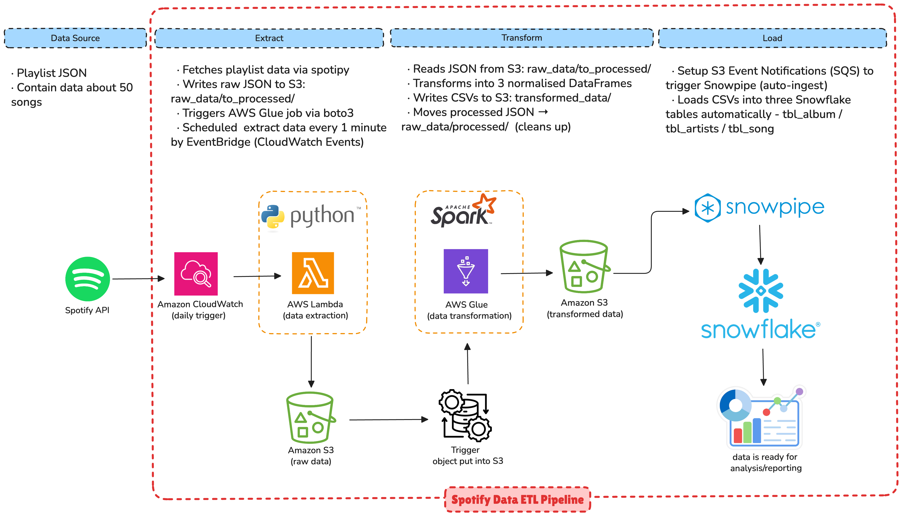
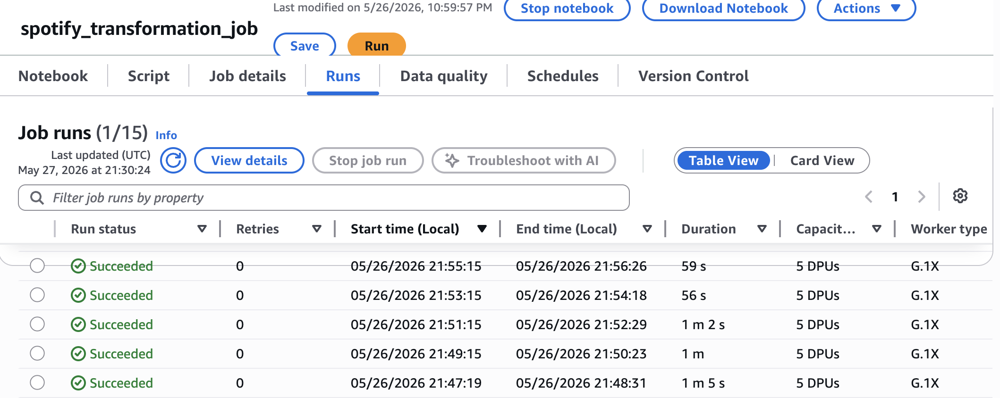
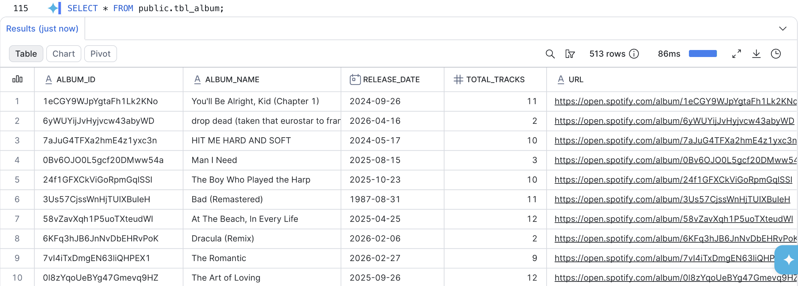
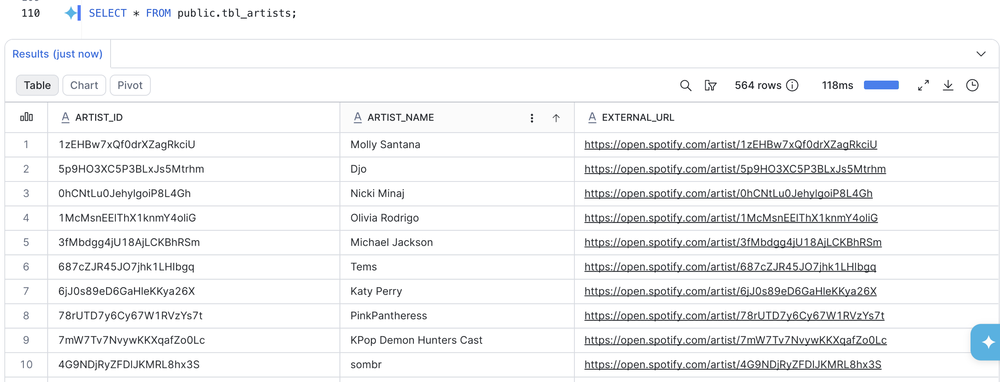
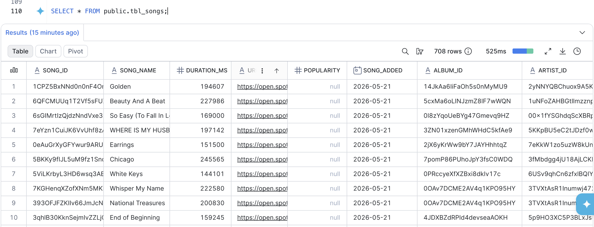

# Spotify ETL Pipeline — AWS Lambda · PySpark · Snowflake

## Project Review

This project builds a fully automated, cloud-native ETL pipeline that continuously extracts Spotify playlist data, transforms it into a structured format, and loads it into a Snowflake data warehouse for analytics.

Raw playlist data is fetched from the **Spotify API** via **AWS Lambda** (Python), stored as JSON in **Amazon S3**, and transformed into three normalised tables — albums, artists, and songs — using **PySpark on AWS Glue**. The cleaned CSVs are then automatically ingested into **Snowflake** through **Snowpipe**, triggered by S3 event notifications. The entire pipeline runs on a schedule with no manual intervention.

**Key capabilities:**
- Fully automated end-to-end pipeline — EventBridge triggers Lambda every minute, Lambda triggers Glue, Glue output triggers Snowpipe
- PySpark transformation on AWS Glue — flattens nested JSON, deduplicates, and splits into album, artist, and song datasets
- Auto-ingest with Snowpipe — new S3 files flow into Snowflake tables automatically via SQS notifications
- Raw data lifecycle management — processed JSON is moved from `to_processed/` to `processed/` after each Glue run
- Three normalised Snowflake tables ready for analytics queries



---

## S3 Folder Structure

```
s3://your-bucket/
├── raw_data/
│   ├── to_processed/      ← Lambda writes raw JSON here; Glue reads from here
│   └── processed/         ← Glue moves JSON here after transformation
└── transformed_data/
    ├── album_data/        ← album CSVs (partitioned by run date)
    ├── artist_data/       ← artist CSVs
    └── songs_data/        ← song CSVs
```

---

## Snowflake Schema

<table>
<tr>
<td>

**`tbl_album`**

| Column | Type |
|--------|------|
| `album_id` | STRING |
| `album_name` | STRING |
| `release_date` | DATE |
| `total_tracks` | INT |
| `url` | STRING |

</td>
<td>

**`tbl_artists`**

| Column | Type |
|--------|------|
| `artist_id` | STRING |
| `artist_name` | STRING |
| `external_url` | STRING |

</td>
<td>

**`tbl_songs`**

| Column | Type |
|--------|------|
| `song_id` | STRING |
| `song_name` | STRING |
| `duration_ms` | INT |
| `url` | STRING |
| `popularity` | INT |
| `song_added` | DATE |
| `album_id` | STRING |
| `artist_id` | STRING |

</td>
</tr>
</table>

---

## ETL Process

### Step 1 — Extract (AWS Lambda)

Lambda is triggered by EventBridge on a schedule and pulls the full playlist from the Spotify API.

- Authenticates with the Spotify API using `spotipy` and OAuth credentials stored as Lambda environment variables
- Fetches all tracks from the target playlist (`PLAYLIST_URI`) with market set to `US`
- Serialises the raw response as a timestamped JSON file and writes it to `raw_data/to_processed/` in S3
- Immediately triggers the AWS Glue job via `boto3` so transformation begins as soon as the raw file lands

---

### Step 2 — Transform (AWS Glue · PySpark)

The Glue job reads all JSON files from `raw_data/to_processed/`, flattens the nested structure, and produces three clean DataFrames.

**Albums:**
- Explodes the `items` array and selects `album.id`, `album.name`, `release_date`, `total_tracks`, and `external_urls.spotify`
- Drop deduplicates by `album_id` — the same album can appear across many tracks

**Artists:**
- Double-explodes `items` then the inner `artists` array to get one row per artist per track
- Selects `artist.id`, `artist.name`, and `external_urls.spotify`
- Drop deduplicates by `artist_id`

**Songs:**
- Double-explodes `items` and `artists` to get one row per song–artist pair
- Selects `song.id`, `song.name`, `duration_ms`, `url`, `popularity`, `added_at`, `album.id`, and `artist.id`
- Parses `added_at` as a `DATE` column (`song_added`)
- Drop deduplicates by `song_id`

---

### Step 3 — Load transformed data to S3 + raw data cleanup

**Write CSVs:**
- Each DataFrame is written as CSV to a date-partitioned path under `transformed_data/`

**Raw data lifecycle:**
- After writing the CSVs, the Glue job lists all JSON files in `raw_data/to_processed/`
- Each file is copied to `raw_data/processed/` then deleted from `to_processed/`
- This ensures the next Glue run does not reprocess already-handled data

---

### Step 4 — Auto-ingest into Snowflake (Snowpipe)

New CSV files in `transformed_data/` automatically trigger Snowpipe via S3 Event Notifications.

- Each S3 prefix has a dedicated SQS notification that maps to a Snowpipe pipe:
  - `album_data/` → `pipe.tbl_album_pipe` → `public.tbl_album`
  - `artist_data/` → `pipe.tbl_artists_pipe` → `public.tbl_artists`
  - `songs_data/` → `pipe.tbl_songs_pipe` → `public.tbl_songs`
- Snowpipe uses `COPY INTO` with the `csv_fileformat` definition (comma-delimited, header skipped, nulls handled, quoted fields supported)
- No manual load step required — data appears in Snowflake within seconds of the Glue job completing

---

## Setup

### 1. Lambda Function

1. **Environment Variables**

   | Key | Value |
   |-----|-------|
   | `SPOTIFY_CLIENT_ID` | your Spotify client ID |
   | `SPOTIFY_CLIENT_SECRET` | your Spotify client secret |
   | `SPOTIFY_REFRESH_TOKEN` | refresh token from `.cache` |

2. **Layer** — upload `spotipy_layer.zip`

3. **IAM Role** — attach `AmazonS3FullAccess` and `AWSGlueServiceRole`

4. **General Configuration** — set Timeout to `1 min 30 sec`

5. **Trigger** — EventBridge (CloudWatch Events)
   - Scheduled expression: `rate(1 minute)` *(for testing only — update before production)*


### 2. AWS Glue

1. **ETL Job** — create a Notebook job (`spotify_transformation_job`) using PySpark

2. **IAM Role** — attach the following policies:
   - `AmazonS3FullAccess`
   - `AWSGlueServiceNotebookRole`
   - `AWSGlueServiceRole`
   - `AWSLambda_FullAccess`
   - `IAMFullAccess`

3. **Worker** — type `G.1X`, 5 workers (Glue version 5.1)

4. **Data Flow**
   - Reads raw JSON from `raw_data/to_processed/`
   - Transforms into album, artist, and song DataFrames (deduplication applied)
   - Writes CSVs to `transformed_data/<entity>_data/<entity>_transformed_<date>/`
   - Copies processed JSON to `raw_data/processed/` and deletes originals


### 3. Snowflake & Snowpipe

1. **IAM Role** — create a role with `AmazonS3FullAccess`; paste the generated `STORAGE_AWS_ROLE_ARN` and `STORAGE_AWS_EXTERNAL_ID` into `Spotify_snowpipe.sql`

2. **Run `Spotify_snowpipe.sql`** in order:
   - Create database `spotify_db`
   - Create storage integration `s3_init`
   - Create CSV file format and stage `spotify_stage`
   - Create tables `tbl_album`, `tbl_artists`, `tbl_songs`
   - Create Snowpipe pipes (`pipe.tbl_album_pipe`, `pipe.tbl_artists_pipe`, `pipe.tbl_songs_pipe`)

3. **SQS Triggers** — run `DESC PIPE pipe.<pipe_name>` to get each pipe's `notification_channel` ARN, then configure three S3 **Event Notifications** (one per entity) pointing to those SQS ARNs:

   | Prefix | Pipe |
   |--------|------|
   | `transformed_data/album_data/` | `pipe.tbl_album_pipe` |
   | `transformed_data/artist_data/` | `pipe.tbl_artists_pipe` |
   | `transformed_data/songs_data/` | `pipe.tbl_songs_pipe` |

4. **Verify** — manually upload a CSV to `transformed_data/` and confirm rows appear in the corresponding Snowflake table

---

## Tech Stack

| Layer | Technology |
|-------|-----------|
| Data source | Spotify Web API (`spotipy`) |
| Extraction | AWS Lambda (Python 3.13) |
| Orchestration | Amazon EventBridge · AWS Lambda (`boto3`) |
| Transformation | AWS Glue 5.1 · PySpark 3.5 |
| Storage | Amazon S3 |
| Loading | Snowpipe (auto-ingest via SQS) |
| Data warehouse | Snowflake |

---

## Local Development

```bash
# install dependencies
uv sync          # or: pip install -e .

# run extraction locally (requires .env with Spotify credentials)
python lambda_run_local.py

# prototype transformations
jupyter notebook spotify_etl.ipynb
```

`.env` file:
```
SPOTIFY_CLIENT_ID=...
SPOTIFY_CLIENT_SECRET=...
SPOTIFY_REFRESH_TOKEN=...
```

## Final Output

After the pipeline ran for 8 minutes, data was extracted from the Spotify API and loaded into Snowflake 5 times automatically. The AWS Glue job run history is shown below:



The three resulting Snowflake tables:

**`tbl_album`**


**`tbl_artists`**


**`tbl_songs`**

